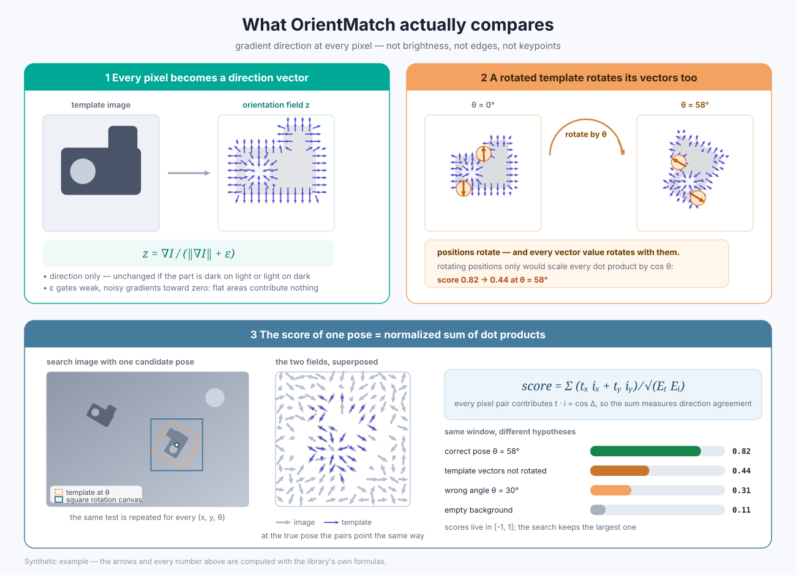
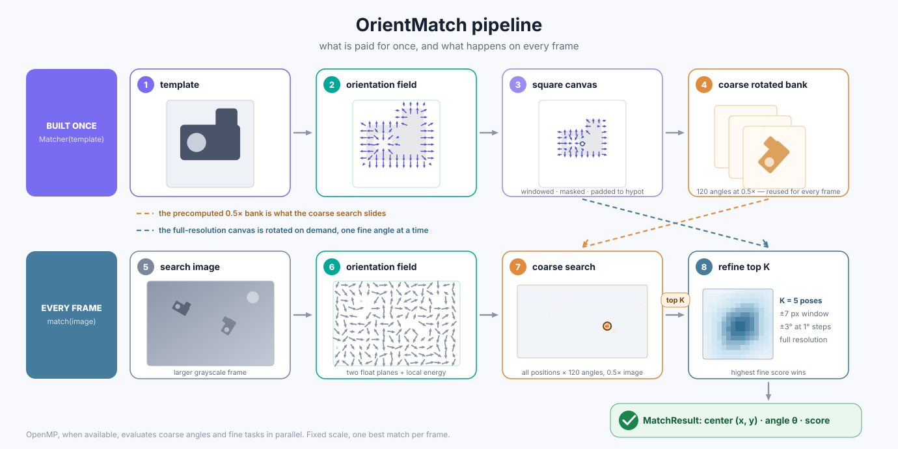
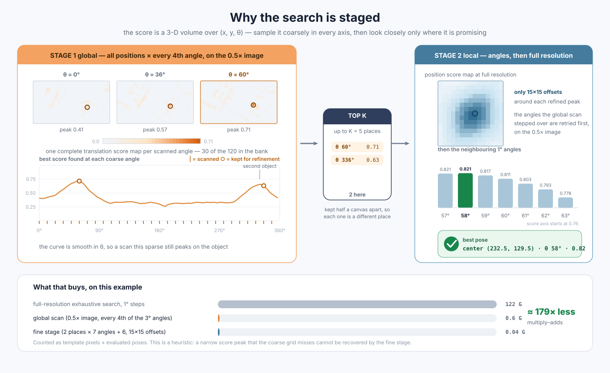

# OrientMatch — Gradient-Orientation Template Matching for OpenCV

[日本語](README.ja.md) | **English**

OrientMatch packages dense gradient-orientation correlation and coarse-to-fine pose
search into a small C++17/OpenCV library. It is an engineering-oriented combination of
established techniques, with a reusable matcher API and explicit operating assumptions.

It is intended as a transparent, reproducible baseline for the following setting:

- one grayscale template;
- known, fixed scale;
- one or more instances of it in a larger grayscale image;
- translation and in-plane rotation;
- CPU execution, optionally parallelized with OpenMP.

The matcher uses the softly gated orientation field

```text
z = (gx, gy) / (sqrt(gx^2 + gy^2) + eps)
```

and normalized, non-centered correlation between the two vector-field components.
It searches all positions in a downsampled image at a sparse set of angles, keeps the best
candidates that stand apart from one another, and then recovers the skipped angles and the
exact pose locally at full resolution.

## What is compared



Every pixel becomes a gradient-direction vector of near-unit length, so a pose is scored on
shape rather than on brightness or contrast. Rotating the template rotates the sampling grid
*and* the vector values; rotating positions only would scale every dot product by `cos θ`.
The score of one pose is the energy-normalized sum of those dot products.

## Overview



The template field, its square rotation canvas, and the coarse rotated bank are built once,
when the `Matcher` is constructed. Each frame is then converted to an orientation field,
scanned globally at reduced resolution over a sparse set of angles, and refined locally --
first over the angles the scan stepped across, then at full resolution. Because every stage
correlates many angles against one image window, that window is transformed once and reused
across them, which is where most of the per-frame cost used to go. The diagram is schematic
and reflects the current fixed-scale scope.

## Positioning

OrientMatch is an early reference-library release. It makes **no claim of a novel
algorithm or state-of-the-art performance**. Gradient-direction similarity, rotated
template banks, and pyramidal pose search are established ideas with precedents including
Steger's shape-based matching and later oriented-gradient template methods:

- C. Steger, “Similarity Measures for Occlusion, Clutter, and Illumination Invariant
  Object Recognition,” DAGM 2001.
- C. Steger, “Occlusion, Clutter, and Illumination Invariant Object Recognition,”
  ISPRS 2002.
- S. Hinterstoisser et al., “Gradient Response Maps for Real-Time Detection of
  Texture-Less Objects,” TPAMI 2012.
- Y. Konishi et al., “Fast and Precise Template Matching Based on Oriented Gradients,”
  ECCV Workshops 2012.

The contribution here is packaging and engineering. In particular, OrientMatch provides:

- one reusable `Matcher` that builds a rotation bank from a single template;
- a dense, continuous two-component field rather than sparse quantized orientations;
- a soft magnitude gate and whole-patch energy-normalized correlation;
- a CPU/OpenCV implementation with optional OpenMP parallelism;
- documented coordinate and angle conventions, validation, tests, and CMake installation;
- an intentionally narrow API for fixed-scale, single-best-pose matching.

These choices form a useful implementation point in the design space; the individual
ingredients and the overall method family are not presented as new.

The implementation was extracted from the image-space control method evaluated in
[radon-template-matching](https://github.com/hijimasa/radon-template-matching).

## Related implementations

The following projects overlap with OrientMatch, but optimize for different
representations or use cases:

| Implementation | Shared ground | Main difference from OrientMatch |
|---|---|---|
| [OpenCV `matchTemplate`](https://docs.opencv.org/4.x/de/da9/tutorial_template_matching.html) | Dense image-space correlation | Searches translation for a fixed template; rotation and coarse-to-fine orchestration are left to the caller. |
| [OpenCV LINEMOD](https://docs.opencv.org/4.x/d7/d07/classcv_1_1linemod_1_1Detector.html) | Gradient orientation and template pyramids | Uses selected, quantized orientation features and normally registers templates for the required views or poses. |
| [`shape_based_matching`](https://github.com/meiqua/shape_based_matching) | C++/OpenCV, gradient orientation, pyramids, rotated/scaled templates | A LINEMOD/HALCON-style sparse-feature matcher with pose-template generation, SIMD, and NMS-oriented detection features. |
| [OpenCV `GeneralizedHoughGuil`](https://docs.opencv.org/4.x/d3/d20/classcv_1_1GeneralizedHoughGuil.html) | Edge gradients and position/rotation/scale estimation | Uses generalized-Hough voting instead of dense normalized correlation. |
| [`batchmatch`](https://github.com/wlruys/batchmatch) | Normalized gradient fields and transformation search | A PyTorch/FFT-oriented registration toolkit for batched affine grids, rather than a small C++ local-refinement matcher. |
| [`corrmatch-rs`](https://github.com/VitalyVorobyev/corrmatch-rs) | Rotation-aware coarse-to-fine template search | Uses intensity ZNCC/SSD in Rust rather than dense gradient-orientation correlation in OpenCV. |

[`benchmarks/`](./benchmarks) measures OrientMatch against the ones that can be run
directly -- a rotated-bank `matchTemplate`, the same coarse-to-fine search scoring
intensity instead of orientation, Fourier-Mellin, and ORB/SIFT with RANSAC -- on Kodak
images under rotation, noise, occlusion, illumination change, JPEG and scale mismatch.
The summary is below; the protocol and its limits are in that directory's README.

No claim is made that this list is exhaustive. The practical distinction is the complete
combination exposed by this library: a single-template C++ API, dense continuous
orientation fields, normalized correlation, and coarse-to-fine translation/rotation
search. For a new application, benchmark the alternatives above on representative data
rather than assuming one method is universally faster or more accurate.

## Measured against other methods

Kodak photographs, 384x256 scenes, a 96x96 template placed at a known pose, 12 images x 3
offsets x 9 angles x 11 conditions. A case succeeds when the angle is within 5 degrees and
the centre within 5 pixels. The protocol, the baselines and their limits are in
[`benchmarks/`](./benchmarks); `benchmarks/results.csv.gz` holds every row behind these
tables.

### Success rate by condition

| Method | clean | noise 25 | noise 50 | occl. 25% | occl. 50% | illum | JPEG 20 | scale 0.95 | scale 1.05 | overall |
|---|---|---|---|---|---|---|---|---|---|---|
| **OrientMatch** | 100.0 | 100.0 | 96.0 | 99.1 | 79.3 | 100.0 | 100.0 | 100.0 | 100.0 | **97.2** |
| NCC coarse-to-fine | 100.0 | 90.4 | 85.2 | 88.6 | 52.5 | 100.0 | 99.4 | 94.8 | 97.2 | 89.8 |
| NCC exhaustive 1° | 100.0 | 89.8 | 83.3 | 90.7 | 61.4 | 100.0 | 99.4 | 94.4 | 97.2 | 90.7 |
| Fourier-Mellin | 9.9 | 7.4 | 5.9 | 6.5 | 4.6 | 10.5 | 6.2 | 6.2 | 6.2 | 7.0 |
| ORB + RANSAC | 64.2 | 44.4 | 16.4 | 0.6 | 0.0 | 55.9 | 53.7 | 58.6 | 60.8 | 39.4 |
| SIFT + RANSAC | 93.2 | 65.1 | 36.4 | 87.3 | 75.3 | 74.4 | 89.2 | 93.8 | 91.4 | 78.5 |

### Accuracy where the method succeeded, and cost

`OMP_NUM_THREADS=8` on an otherwise idle 22-core machine. One-shot includes preparing the
template; per frame is the search alone, with per-template work hoisted out -- for every
method, not only this one.

| Method | median angle err [deg] | median position err [px] | one-shot [ms] | per frame [ms] |
|---|---|---|---|---|
| **OrientMatch** | 0.25 | 0.32 | 26.4 | **14.2** |
| NCC coarse-to-fine | 0.25 | 0.37 | 53.9 | 46.6 |
| NCC exhaustive 1° | 0.25 | 0.37 | 502.4 | 495.7 |
| Fourier-Mellin | 0.93 | 0.54 | 23.8 | 23.8 |
| ORB + RANSAC | 0.81 | 0.51 | 5.2 | 4.6 |
| SIFT + RANSAC | 0.06 | 0.16 | 17.1 | 15.1 |

### Telling a present template from an absent one

AUC is the probability that a present template outscores an absent one, over the negative
conditions where the template comes from a different image. Scores are comparable only
within a row: the feature methods report an inlier count, not a correlation.

| Method | AUC clean | AUC noise 25 |
|---|---|---|
| **OrientMatch** | 1.000 | **0.999** |
| NCC coarse-to-fine | 1.000 | 0.922 |
| NCC exhaustive 1° | 1.000 | 0.923 |
| Fourier-Mellin | 0.640 | 0.624 |
| ORB + RANSAC | 0.825 | 0.741 |
| SIFT + RANSAC | 0.967 | 0.834 |

### What to read out of this

The row that matters most is **NCC coarse-to-fine**: it runs the identical search --
same coarse level, same angle bank, same refinement, same candidate count -- and scores
intensity correlation instead of the orientation field. The 89.8% against 97.2% is
therefore about the scoring function, not the search. The exhaustive 1 degree NCC lands in
the same place (90.7%) at 35 times the cost per frame, which says the coarse-to-fine search
is not what limits it either.

Feature matching is a different trade. SIFT is the most *precise* method here by a wide
margin -- 0.06 degrees against a correlation method's quantization floor of 0.25 -- and it
is fast, but it needs texture: at noise sigma 50 it finds the pose in 36% of cases against
OrientMatch's 96%. ORB is the cheapest method by 3x and the least reliable. Fourier-Mellin
is not competitive here at all, because it assumes the two images differ by one global
rotation, which a small template inside a larger scene does not.

None of this generalizes past the setting measured: one grayscale template, known scale,
one instance, photographic scenes. Templates that are textureless, images with many
instances, or an unknown scale are all outside it.

## Requirements

- CMake 3.16 or newer
- a C++17 compiler
- OpenCV (`core` and `imgproc`; `imgcodecs` is needed only for the example CLI)
- OpenMP (optional)

## Build and test

```bash
cmake -S . -B build -DCMAKE_BUILD_TYPE=Release
cmake --build build -j
ctest --test-dir build --output-on-failure
```

Run the example CLI:

```bash
./build/orient_match_cli search.png template.png
./build/orient_match_cli search.png template.png -45 90
```

The output is a JSON object containing the absolute template-center coordinates, rotation
angle in degrees, and correlation score.

## C++ API

```cpp
#include <opencv2/imgcodecs.hpp>
#include <orient_match/orient_match.hpp>

cv::Mat image = cv::imread("search.png", cv::IMREAD_GRAYSCALE);
cv::Mat templ = cv::imread("template.png", cv::IMREAD_GRAYSCALE);

orient_match::MatcherOptions options;
options.coarse_scale = 0.5;
options.coarse_angle_step_deg = 3.0;
options.fine_angle_step_deg = 1.0;
options.refine_top_k = 5;
options.angle_scan_stride = 0;  // 0 lets the matcher pick the global-scan angle step

// Construction precomputes the template field and coarse rotated-template bank.
orient_match::Matcher matcher(templ, options);
orient_match::MatchResult result = matcher.match(image);

if (result) {
    std::cout << result.center.x << ", " << result.center.y << "\n";
    std::cout << result.angle_deg << " deg, score=" << result.score << "\n";
}
```

### Deciding whether the template is there at all

By default `match()` always reports its best pose, however weak. Set `min_score` to make it
answer the presence question as well:

```cpp
options.min_score = 0.6;   // reject anything below this
orient_match::Matcher matcher(templ, options);

const auto result = matcher.match(image);
if (result) {
    // found
} else if (result.status == orient_match::MatchStatus::below_min_score) {
    // the template is not in this image, or is too occluded to recognise
}
```

There is no universal threshold: the score depends on how much of the template is textured,
so calibrate `min_score` on images that do and do not contain your object. Two fields help
with that, and are filled in for rejected results too:

- `MatchResult::score` -- the final normalized correlation.
- `MatchResult::margin` -- how far the best coarse candidate stands above the best one at
  least one canvas radius away. A present object wins its position outright; an empty scene
  produces a near tie between look-alike peaks.

On the reference scenes (cluttered backgrounds, each also holding a mirrored copy of the
template as a hard negative), a present object scored 0.76 or above and an absent one 0.52
or below, so any threshold in between separated them. A mirrored look-alike is the strongest
false positive; an object at the wrong scale is rejected easily, because scale is fixed.
Detection degrades gracefully with occlusion -- 0.74 at 25% occluded and 0.51 at 50% -- and
70% occlusion is indistinguishable from absence.

When `min_score` is set, the coarse level also gives up early on images whose best coarse
score cannot plausibly reach it, skipping all full-resolution work. On empty scenes that
saves a little over 40% of the frame time; `coarse_gate_ratio` controls how eagerly it does
so, and its default leaves a margin against the lowest coarse-to-final score ratio measured
on the reference scenes.

### Finding more than one instance

`match()` reports the best pose. `matchAll()` reports every distinct place it examined,
best first:

```cpp
options.min_score = 0.6;      // set this before relying on the length of the list
options.refine_top_k = 8;     // also the largest number of matches that can come back
orient_match::Matcher matcher(templ, options);

for (const orient_match::MatchResult &m : matcher.matchAll(image)) {
    std::cout << m.center << " " << m.angle_deg << " deg, score=" << m.score << "\n";
}
```

`refine_top_k` is the search budget and therefore also the cap on the number of matches:
raising it examines, and can report, more places, at proportional cost. Two knobs control
what counts as a separate place:

- `candidate_separation` -- how far apart two candidates must be at the coarse level, as a
  fraction of the rotation canvas. This is what keeps the budget on distinct places instead
  of on several angles of one, and it is a hard floor: instances closer than this are
  reported as one, whatever the overlap setting says.
- `max_overlap` -- a refined pose is dropped when its template rectangle overlaps a better
  one by more than this, as intersection over union. Unlike the separation above, this is
  measured on the template's own rectangle at its detected angle rather than on the square
  canvas, so a long thin template is not suppressed over the area it does not occupy.

`matchAll()` returns an empty list when nothing reaches `min_score`; `match()` is the form
that reports why. With `min_score` left at its default nothing is rejected on score, so the
list always runs to `refine_top_k` entries and its tail is noise.

In practice `max_overlap` earns its keep on duplicate detections of one object rather than
on genuinely overlapping instances. Two copies of the same template that overlap enough for
the setting to matter also corrupt each other's orientation evidence: in a test scene, two
instances 84 pixels apart (a 12% overlap of a 96-pixel-wide template) both scored well and
were both reported, while at 70 pixels apart the occluded one fell from 0.74 to 0.32 and
was no longer a detection at all.

An optional single-channel template mask is supported:

```cpp
orient_match::Matcher matcher(templ, mask, options);
```

Mask pixels equal to zero are excluded. Gradients are computed before masking so the mask
boundary does not create a synthetic template edge. After rotation, the interpolated mask
is converted back to a binary support before energy normalization; this keeps the cosine
score bounded despite interpolation at the mask boundary.

### CMake consumer

After installing OrientMatch, a consuming project can use:

```cmake
find_package(OrientMatch CONFIG REQUIRED)
target_link_libraries(my_program PRIVATE OrientMatch::orient_match)
```

## Coordinates and angle convention

- Pixel centers follow OpenCV coordinates: the top-left pixel center is `(0, 0)`.
- `MatchResult::center` is the absolute center of the transformed template in the input.
- Positive angles are counter-clockwise in the convention used by
  `cv::getRotationMatrix2D`.
- Returned angles are normalized to `[0, 360)`.
- `angle_extent_deg` defines the half-open interval
  `[angle_start_deg, angle_start_deg + angle_extent_deg)`.

## Algorithm outline

1. Blur the grayscale image and template, then compute Sobel gradients.
2. Normalize each vector using a soft, image-adaptive gate.
3. Apply a Gaussian window and optional mask to the template field.
4. At the coarse image level, correlate every `angle_scan_stride`-th rotation of the bank
   over all valid translations. The image planes are transformed once and every angle of
   the scan reuses them; the two angles half a turn apart share their energy correlation,
   whose support mask is identical.
5. Keep the best `refine_top_k` candidates, discarding any that lies within half a canvas
   of a better one, so each is a distinct place rather than another angle of the same place.
6. Around each candidate, still on the coarse image, try the bank angles the scan stepped
   across.
7. At full resolution, search a local position ROI and the neighboring fine angles; search
   the leading candidate one ring wider, because the coarse level can be a step or two off
   the full-resolution optimum.
8. Keep the best pose at each place. `match()` returns the highest, `matchAll()` returns
   them all, both subject to `min_score`.



The score is a volume over `(x, y, θ)`. The global stage samples it coarsely in every axis --
half resolution, and every fourth angle -- and the later stages look closely only around the
top `K` places, which costs a small fraction of a full-resolution exhaustive search. Sparse
angle sampling is safe because the score varies smoothly with angle: over the reference
scenes, canvases from 64 to 500 pixels, a 12 degree scan reproduced the pose of an
exhaustive scan exactly, with the first differences appearing at 24 degrees. It remains a
speed-oriented heuristic and does not guarantee that a narrow global optimum survives.

All three figures are generated from a run of the algorithm on a synthetic scene; the
scripts live in [`tools/figures`](./tools/figures).

Template construction precomputes the coarse rotated-template bank, making a `Matcher`
suitable for repeated use on multiple frames. The object is immutable after construction;
`match()` uses only local working buffers.

## Scope and known limitations

- Scale is assumed known. A scale mismatch is not searched.
- Multiple instances are reported by `matchAll()`, but how close two of them may stand is
  limited by `candidate_separation` at the coarse level, and in practice by the score:
  instances that overlap substantially degrade each other's evidence.
- Position and angle are discrete. There is no subpixel/sub-degree peak interpolation yet.
- Coarse-to-fine search is heuristic and can miss a narrow global optimum.
- Excessively fine angle grids are rejected instead of allocating an unbounded template
  bank; the current limits are 4,096 coarse angles, 4,097 fine offsets, and 1,000,000 fine
  tasks per match.
- `coarse_scale` must leave the square template canvas at least 3 x 3 pixels.
- The correlation score is not a calibrated probability or universal detection threshold.
  `min_score` must be calibrated per template on representative positive and negative images.
- A square rotation canvas must fit entirely inside the search image.
- The current implementation rotates full-resolution templates during refinement; very
  large templates or wide fine searches can be expensive.
- Per-frame work is bound by memory bandwidth more than by arithmetic, so throughput stops
  improving well before every core is busy. On a 22-core test machine the best setting was
  around 8 threads; more than that made every frame slower.
- This project does not currently attempt to replace feature-based matching, learned
  detectors, or full affine registration outside its stated fixed-scale setting.

## License

MIT. See [LICENSE](LICENSE).
